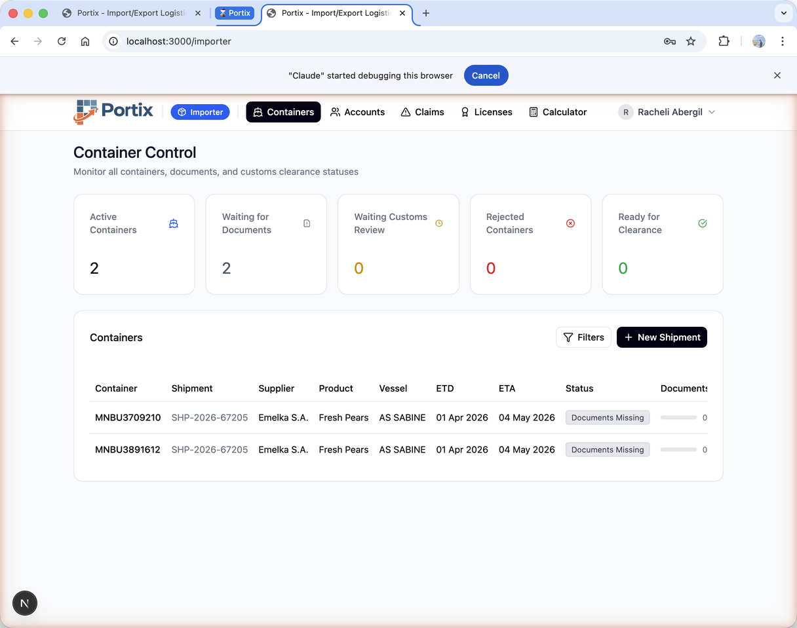
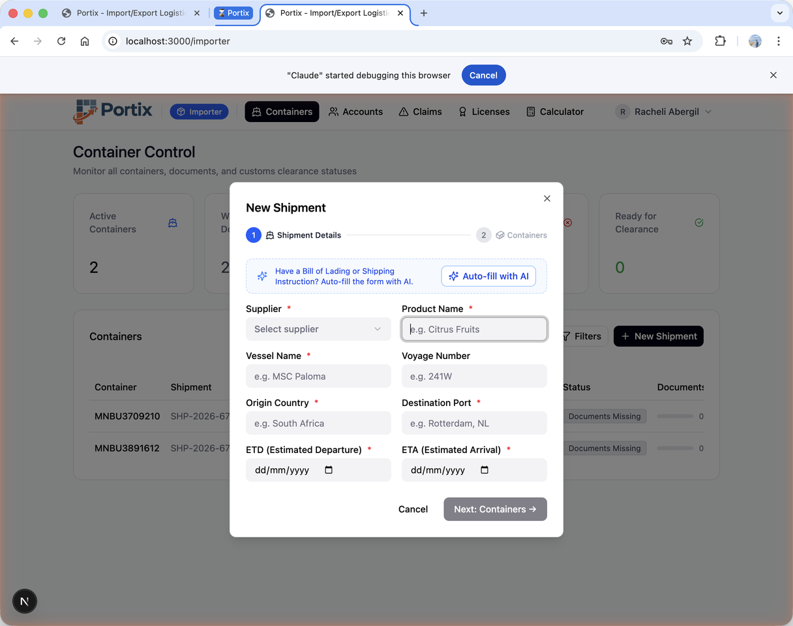
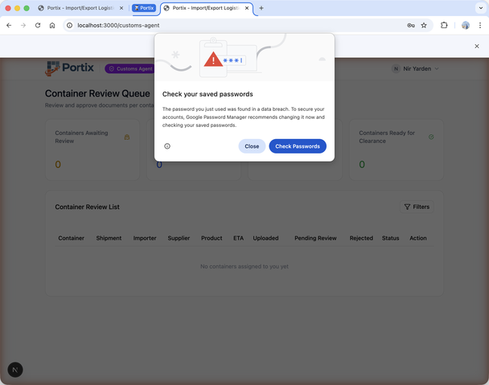
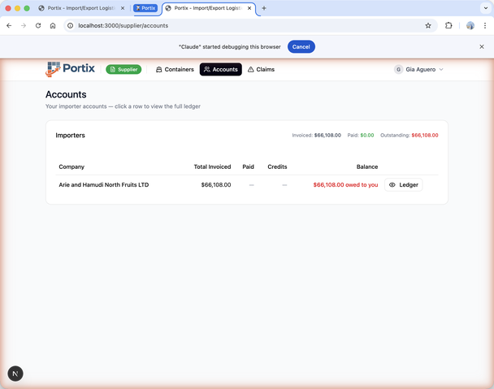

# Portix — Import/Export Logistics Platform

> End-to-end logistics management for importers, suppliers, and customs agents — powered by AI document classification and real-time collaboration.

[](https://nextjs.org/)
[](https://www.typescriptlang.org/)
[](https://supabase.com/)
[](https://tailwindcss.com/)
[](https://ai.google.dev/)

---

## Screenshots

### Importer Dashboard


### New Shipment — AI-Assisted Modal


### Customs Agent — Document Review Queue


### Financial Ledger — Accounts & Transactions


---

## Key Features

- **AI Document Classification** — Upload a shipping document once; Google Gemini 2.5 Flash identifies the document type, extracts metadata, and auto-fills the relevant container records.
- **Three-Role Workflow** — Importers monitor containers, suppliers upload documents, and customs agents review and approve — each with a scoped, role-aware dashboard.
- **Automated Status Advancement** — DB triggers auto-advance container status (`waiting_customs_review` → `ready_for_clearance`) as documents are approved, with no manual intervention.
- **Real-Time Claims Chat** — Dispute resolution thread between importer and supplier with file attachments, lightbox preview, and Supabase Realtime push updates.
- **AI Claim Summaries** — Gemini generates a concise claim summary on demand or automatically every night via a pg_cron job.
- **Financial Ledger** — Full transaction history per trading partner (invoices, payments, credit notes) with automatic draft creation from invoice OCR.
- **Import Licenses** — License management with expiry warnings and AI-powered data extraction from license documents.
- **Model Fallback** — Gemini API calls automatically retry across `gemini-2.5-flash → gemini-1.5-flash → gemini-1.5-pro` on 503/429 errors.

---

## Tech Stack

| Layer | Technology |
|---|---|
| Framework | Next.js 15 (App Router) |
| Language | TypeScript (strict) |
| Styling | Tailwind CSS v4 |
| Components | shadcn/ui + Radix UI |
| Database | Supabase PostgreSQL (portix schema) |
| Auth | Supabase Auth (email/password) |
| Storage | Supabase Storage (4 private buckets) |
| AI | Google Gemini 2.5 Flash (Supabase Edge Functions) |
| State | TanStack Query v5 |
| Realtime | Supabase Realtime (postgres_changes) |
| Cron | pg_cron (nightly AI summaries) |

---

## Local Setup

### Prerequisites

- Node.js 18+
- A [Supabase](https://supabase.com/) project
- A [Google AI Studio](https://ai.google.dev/) API key (Gemini)

### 1. Clone & Install

```bash
git clone https://github.com/your-org/portix.git
cd portix
npm install
```

### 2. Environment Variables

```bash
cp .env.local.example .env.local
```

Populate `.env.local` with values from your Supabase dashboard:

```env
NEXT_PUBLIC_SUPABASE_URL=https://your-project.supabase.co
NEXT_PUBLIC_SUPABASE_ANON_KEY=your-anon-key
```

### 3. Database Migrations

```bash
npx supabase db push
```

Or apply migrations sequentially:

```bash
npx supabase migration up
```

### 4. Edge Function Secrets

In the Supabase Dashboard → Edge Functions → Secrets, add:

```
GEMINI_API_KEY = your-google-ai-studio-key
```

### 5. Deploy Edge Functions

```bash
npx supabase functions deploy parse-shipment
npx supabase functions deploy classify-documents
npx supabase functions deploy generate-claim-summary
npx supabase functions deploy extract-license-data
```

### 6. Run the Dev Server

```bash
npm run dev
```

Open [http://localhost:3000](http://localhost:3000).

---

## Project Structure

```
portix/
├── app/
│   ├── (dashboard)/
│   │   ├── importer/       # Container control, accounts, claims, licenses
│   │   ├── supplier/       # Upload docs, manage cargo media
│   │   └── customs-agent/  # Document review queue
│   └── auth/               # Supabase Auth flows
├── components/             # Shared UI (container-detail, claims, accounts…)
├── lib/                    # Supabase client + type definitions
├── hooks/                  # TanStack Query hooks + Realtime subscriptions
└── supabase/
    ├── migrations/         # 23 migrations (schema, RLS, triggers, seed)
    └── functions/          # Deno Edge Functions (AI, OCR, summaries)
```

---

## Roles & Test Accounts

| Role | Email | Password |
|---|---|---|
| Importer | racheli@portix.test | 12345678 |
| Supplier | gia@portix.test | 12345678 |
| Customs Agent | customs@portix.test | 12345678 |

---

## License

MIT
