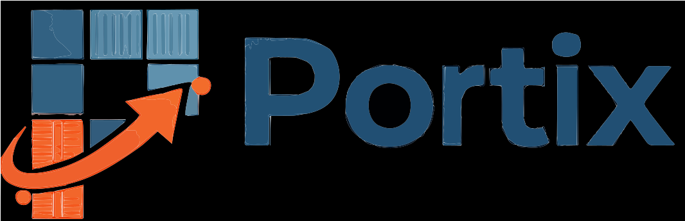
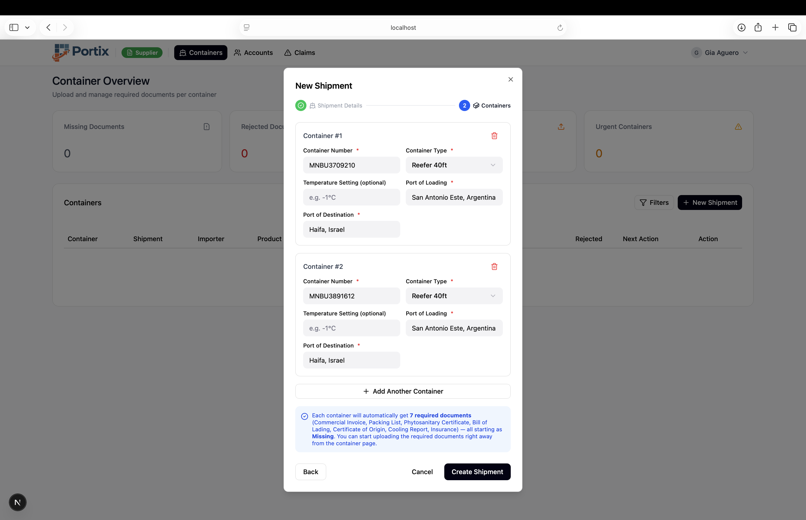
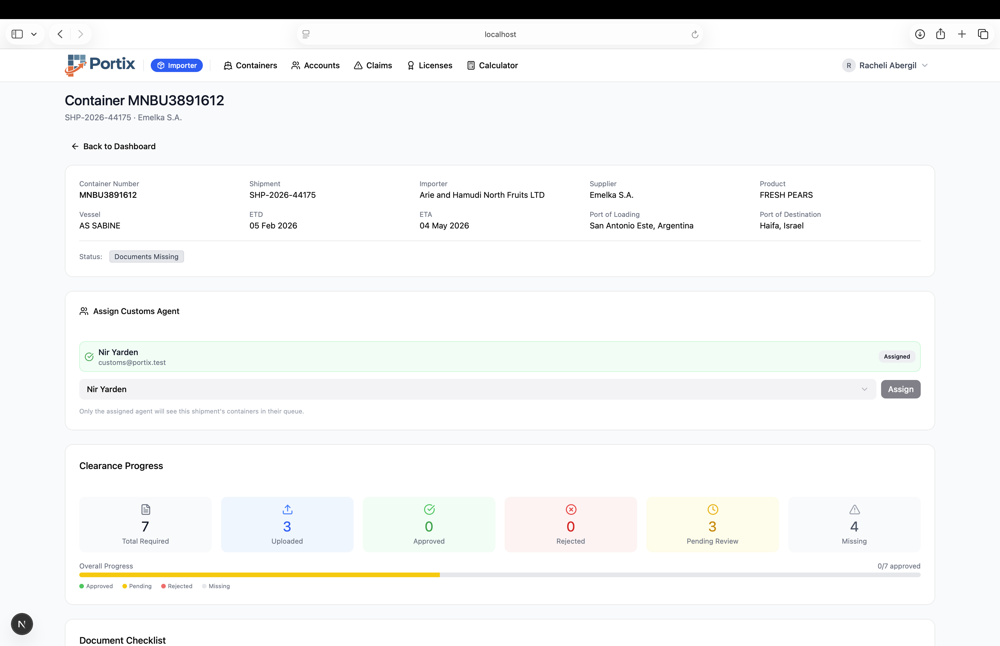
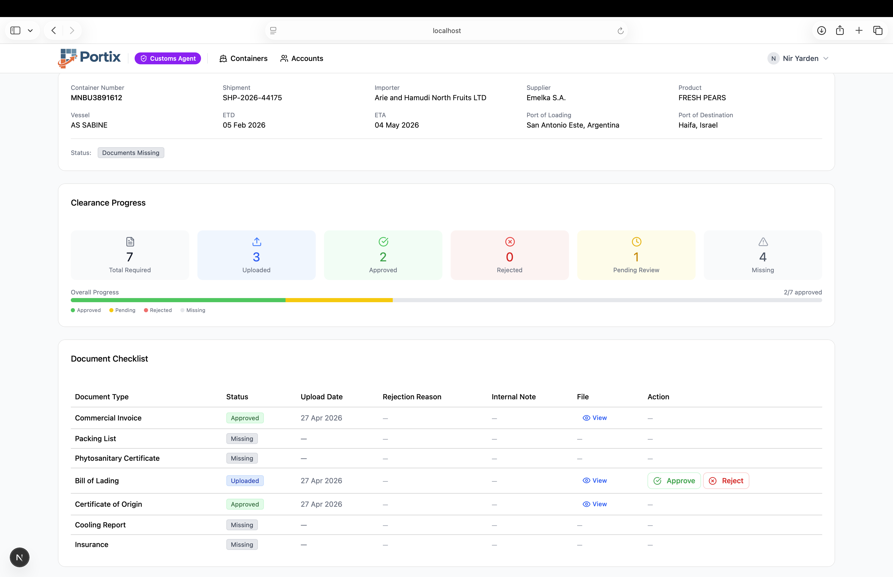
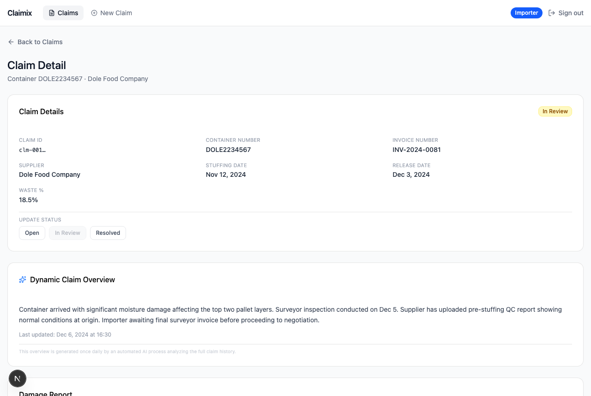
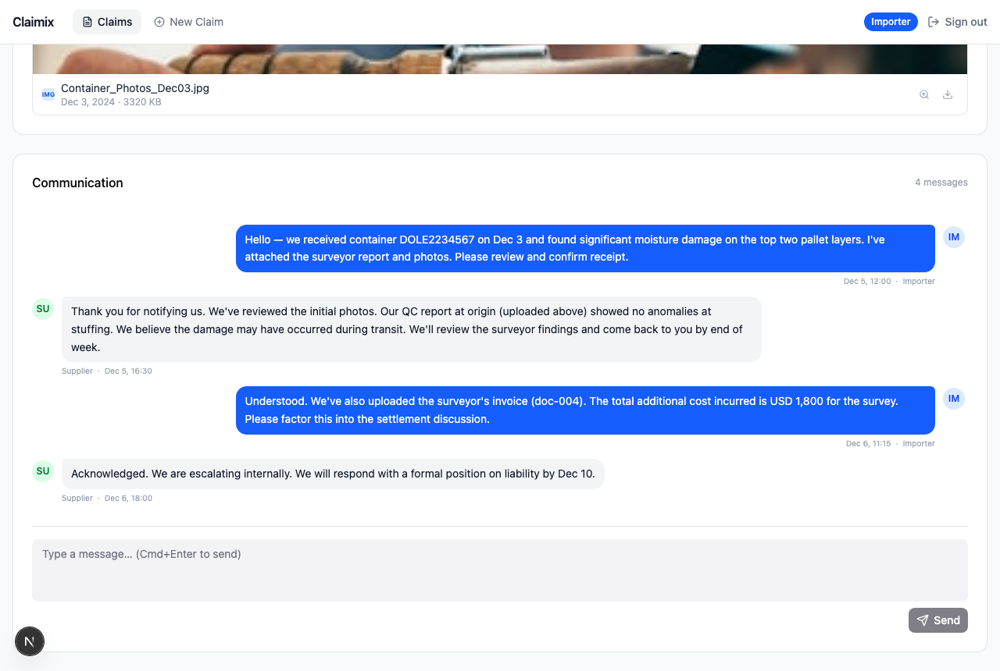
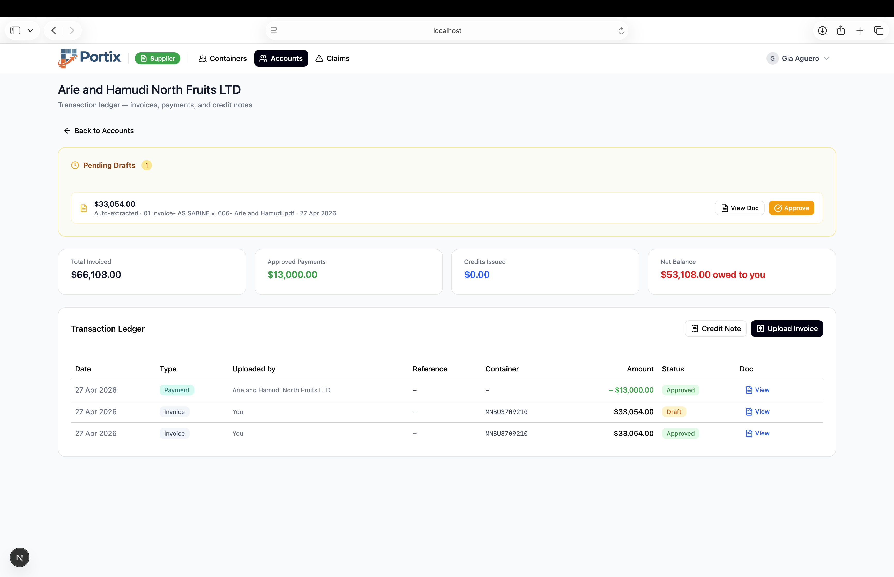

<div align="center">



# The Zero-Touch Intelligent Logistics OS

**Portix eliminates manual work across the entire import/export lifecycle — from supplier document upload to customs clearance — using multimodal AI, real-time collaboration, and enterprise-grade security.**

*Built for the teams moving the world's produce, one container at a time.*

---

[](https://nextjs.org/)
[](https://www.typescriptlang.org/)
[](https://supabase.com/)
[](https://ai.google.dev/)
[](https://tailwindcss.com/)
[](https://tanstack.com/query)

</div>

---

## The Problem with Global Trade Today

Every shipment of fresh produce, electronics, or industrial goods crosses borders through a gauntlet of paperwork, manual coordination, and fragmented communication. A single 40ft reefer container generates **7 mandatory customs documents**, requires coordination between **3 to 5 parties**, and can be delayed by weeks if even one document is rejected.

The industry still runs on WhatsApp threads, emailed PDFs, and spreadsheets. Customs clearance delays cost the average importer **$300–$800 per day** in storage fees alone.

**Portix closes that gap.** It's the operating system for cross-border trade — connecting importers, suppliers, and customs agents in a single workspace where AI handles the paperwork and humans handle the decisions.

---

## How It Works: The Three-Party Workflow

```
Supplier                    Portix AI Engine               Importer / Customs Agent
────────                    ─────────────────               ───────────────────────
Upload any document   →     Classify · Extract · Route  →  Instant visibility + review
(invoice, BL, cert…)        (Gemini 2.5 Flash)             (zero re-entry, zero email)
```

Portix is built around **the container as the unit of work**. Every document, every status, every transaction, every dispute lives on the container — not in a disconnected ERP or email thread.

---

## Core Product Modules

---

### 01 · AI-Powered Document Ingestion

> *"Upload once. Portix figures out the rest."*



A supplier uploads a single PDF — it could be a commercial invoice, a "Frankenstein" bundle with three document types merged, or an image taken on a phone at the port. Portix sends it to **Google Gemini 2.5 Flash** with a multimodal classification prompt.

Gemini identifies every document type present, extracts structured metadata (supplier name, invoice total, container number, issue date), and maps the result to the correct container row — **without the supplier specifying anything**.

**What gets extracted automatically:**
- Document type (`commercial_invoice`, `bill_of_lading`, `certificate_of_origin`, and 4 more)
- Container number — matched to the correct container in a multi-container shipment
- `extractedData`: supplier name · total amount · currency · item count
- `document_number` and `issue_date` for audit trails

**When a document covers `ALL` containers** (e.g. a BL for an entire shipment), Portix fans the update out across every sibling container automatically.

**Business Impact**

| Metric | Before Portix | With Portix |
|---|---|---|
| Time to classify & file a document | 8–15 min (manual) | < 5 seconds |
| Re-keying errors | Common — 1 in 12 documents | Zero |
| Multi-container document routing | Manual email to coordinator | Automatic fan-out |
| Supplier onboarding friction | Training required | Upload → done |

---

### 02 · The Importer Control Tower

> *"Real-time visibility across every container, every voyage, every partner."*



The importer dashboard is a live control tower. Every container in every active shipment shows its exact document status, clearance progress, and assigned customs agent — updated in real time without a page refresh.

**Customs Agent Assignment** is built directly into the container view. The importer selects an agent from the platform directory; from that moment, only that agent sees these containers in their review queue. This creates a clean, auditable chain of custody that protects both the importer and the agent.

**Key capabilities:**
- **Clearance Progress bar** — visual 7-of-7 document approval tracker per container
- **One-click customs agent assignment** — scoped visibility; the agent sees nothing until assigned
- **Live carrier tracking** — ETA updates fed from the carrier API, surfaced inline
- **KPI dashboard** — Active Containers · Waiting Review · Rejected · Ready for Clearance

**Business Impact**

| Metric | Before Portix | With Portix |
|---|---|---|
| Time to check shipment status | 15 min (emails + calls) | Instant |
| Risk of assigning wrong agent | High (verbal/email) | Eliminated — enforced by DB RLS |
| ETA surprise delays | Common | Proactive carrier API alerts |
| Customs agent accountability | None | Full audit trail per document |

---

### 03 · The Compliance Engine

> *"Every document. Every container. Every approval — tracked, enforced, and auditable."*



The customs agent gets their own scoped workspace: a queue of exactly the shipments they have been assigned to — nothing more, nothing less. The 7-document checklist is the heart of the clearance workflow. Each document row shows its upload date, current status, rejection reason, and an internal note visible only to the agent.

**The enforcement rules are DB-level, not UI-level:**
- A container cannot advance to `ready_for_clearance` until all 7 documents are in `approved` status — enforced by a PostgreSQL trigger, not frontend logic
- Rejecting a document requires a mandatory free-text reason — enforced by a `CHECK` constraint
- An approved document can never be overwritten — status transitions are one-way in the DB
- The agent's `internal_note` column is **column-level secured** via a view (`v_documents_public`) — importers and suppliers never see it, even if they query the table directly

**Document lifecycle:**
```
missing → uploaded → under_review → approved ✓
                                  ↘ rejected → (supplier re-uploads) → uploaded → ...
```

**Business Impact**

| Risk | Industry Standard | Portix |
|---|---|---|
| Document forgery / substitution | Manual visual check | Immutable upload audit trail |
| Rejection without explanation | Verbal / email | Mandatory reason, stored permanently |
| Internal agent notes leaking | Separate system | Column-level RLS — cryptographically isolated |
| Clearance advance without full docs | Possible | Impossible — DB trigger blocks it |

---

### 04 · Integrated Claims & Dispute Resolution

> *"When goods arrive damaged, every hour without resolution costs money. Portix resolves disputes in days, not months."*

<table>
<tr>
<td width="50%">



</td>
<td width="50%">



</td>
</tr>
</table>

Import claims — damaged goods, short shipments, quality disputes — are one of the most expensive and time-consuming parts of cross-border trade. Traditionally they play out over email chains that span weeks, with evidence scattered across inboxes and no shared record of what was agreed.

Portix embeds a **structured dispute resolution workspace** directly inside the container that the claim relates to. The importer opens a claim with a claim type, estimated amount, and description. From that moment, the importer and supplier share a persistent, evidence-linked thread.

**What makes this different from email:**

- **Context-aware** — the claim is linked to the exact container, shipment, invoice, and document records. Every message can reference evidence already in the system.
- **AI-generated dynamic summary** — Gemini reads the full claim history (messages, documents, amounts) and writes a concise, neutral situation summary. It updates automatically every night at 23:00 UTC via `pg_cron`, and can be refreshed on-demand with one click. The summary above reads: *"Container arrived with significant moisture damage affecting the top two pallet layers. Surveyor inspection conducted on Dec 5. Supplier has uploaded pre-stuffing QC report showing normal conditions at origin..."*
- **File attachments with lightbox preview** — surveyors' reports, cargo photos, invoices dragged directly into the thread
- **Real-time delivery** — messages appear instantly via Supabase Realtime `postgres_changes` subscriptions. No polling, no refresh.
- **Structured damage report** — waste %, affected units, estimated loss, inspector details — stored as structured data, not buried in a PDF

**Claim status flow:**
```
open → under_review → negotiation → resolved → closed
```

**Business Impact**

| Metric | Industry Standard | Portix |
|---|---|---|
| Average time to first supplier response | 3–7 days (email) | Same session (realtime chat) |
| Evidence organisation | Scattered across inboxes | Centralised, linked to container |
| Dispute summary for management | Manual write-up | AI-generated, always current |
| Audit trail for legal escalation | Fragmented | Complete, timestamped, tamper-evident |
| Cost of unresolved claims per shipment | $2,000–$15,000+ | Proactive resolution pathway |

---

### 05 · Intelligent Financial Ledger

> *"From invoice PDF to draft transaction in seconds. No data entry. No reconciliation gaps."*



The accounts module maintains a live per-partner ledger of every invoice, payment, and credit note — with **automatic draft creation powered by invoice OCR**.

When a supplier uploads a commercial invoice, the `classify-documents` Edge Function extracts the `totalAmount` via Gemini and automatically calls `handle_make_invoice_draft` — creating a pending transaction record linked to the correct container. The supplier sees it in "Pending Drafts" and approves it in one click. No manual entry. No reconciliation meeting.

**What the ledger tracks:**
- `Total Invoiced` — sum of all approved invoice transactions
- `Approved Payments` — SWIFT payments confirmed with proof-of-payment upload
- `Credits Issued` — credit notes raised against rejected or damaged goods
- `Net Balance` — three-state display: debt (red) · credit (green) · settled (grey)

**SWIFT proof-of-payment flow:**
The importer uploads a SWIFT document to the `swift-documents` private storage bucket. Portix stores a signed URL reference linked to the payment record — giving both parties a verifiable payment proof without exposing raw banking data.

**Business Impact**

| Process | Before Portix | With Portix |
|---|---|---|
| Invoice entry after document upload | Manual, same-day or next-day | Automatic — seconds after upload |
| Reconciliation meeting cadence | Weekly or monthly | Eliminated — ledger is always current |
| Payment proof storage | Emailed PDFs | Signed URL in private bucket, permanently linked |
| Outstanding balance visibility | Finance team only | Both parties, real-time |

---

## Technical Architecture — The Secret Sauce

### Resilient AI Infrastructure: 3-Tier Gemini Failover

Production AI workloads fail. Gemini 2.5 Flash is under constant demand from global users — 503 overload and 429 rate-limit responses are a real operational risk. Portix treats AI calls like distributed systems: with automatic fallback and zero user-visible failure.

```
Request
  │
  ▼
┌─────────────────────────────────────────────────┐
│  Tier 1: gemini-2.5-flash                        │  ← Primary: fastest, most capable
│  503 Overloaded / 429 Rate Limited / 404 Gone → │
│  Tier 2: gemini-3-flash                          │  ← Fallback 1: alternate model
│  503 / 429 / 404 →                               │
│  Tier 3: gemini-2.5-pro                          │  ← Fallback 2: most robust
│  All fail →                                      │
│  Return 503 with user-friendly message           │
└─────────────────────────────────────────────────┘
```

**Why 404 is also a fallback condition:** Model IDs change as Google releases and deprecates versions. Portix treats a 404 "model not found" response as a graceful signal to try the next tier — it future-proofs the system against Google's model version lifecycle without a code change.

Every other HTTP error (400 invalid prompt, 401 invalid key) triggers an immediate fail-fast response — only overload/rate-limit/not-found conditions trigger the fallback loop.

**Implemented as Supabase Deno Edge Functions** — cold-start time under 80ms, global edge deployment, no server management.

---

### Enterprise Security: Company-Level Secure Multi-Tenancy

Portix runs all three user roles — importers, suppliers, and customs agents — in a **single shared PostgreSQL database** with zero data leakage between companies. This is achieved through PostgreSQL Row Level Security (RLS) policies enforced at the database level, not the application layer.

**Why database-level matters:** Application-level filtering can be bypassed. A bug in a React component, a misconfigured API route, or a direct Supabase REST API call can all expose data if security lives in the app. Portix's RLS policies mean that even if a supplier knew another importer's container UUID and made a direct API call, they would receive zero rows — the database itself enforces the boundary.

```
┌─────────────────────────────────────────────────────────────────┐
│  auth.uid()  ←  Supabase JWT (verified, tamper-proof)           │
│                                                                 │
│  POLICY: containers                                             │
│  ├─ Importer  →  WHERE importer_id = auth.uid()                 │
│  ├─ Supplier  →  WHERE supplier_id = auth.uid()                 │
│  └─ Agent     →  WHERE EXISTS (                                 │
│                    SELECT 1 FROM shipments                      │
│                    WHERE shipments.id = containers.shipment_id  │
│                    AND shipments.customs_agent_id = auth.uid()  │
│                  )                                              │
│                                                                 │
│  COLUMN-LEVEL: documents.internal_note                          │
│  └─ Only customs_agent can SELECT — enforced via view           │
└─────────────────────────────────────────────────────────────────┘
```

**Key security properties:**

| Property | Implementation |
|---|---|
| Cross-company data isolation | RLS per row, per table, per operation |
| Agent scoping | Agent only sees containers in their assigned shipments |
| Internal note isolation | Column-level security via `v_documents_public` view |
| Importer assignment rights | `EXISTS` subquery on `shipments.customs_agent_id` — no function calls, no STABLE caching risk |
| Storage access | All buckets private — all downloads via signed URLs with 1-hour expiry |
| Service-role operations | AI Edge Functions use service role key — RLS bypassed only server-side |

**The recursion-free pattern:** Early versions of the RLS policies used `portix.is_importer()` helper functions (declared `STABLE`) in UPDATE contexts. Under PostgreSQL's query planner, STABLE function results can be cached within a statement — causing silent failures when an importer tried to assign a customs agent to a supplier-created shipment. All policies were rewritten to use direct `EXISTS (SELECT 1 FROM ...)` clauses (migration 00313, 00325) — zero helper functions, zero caching risk.

---

## Tech Stack

<div align="center">

| Layer | Technology | Why |
|---|---|---|
| **Framework** | Next.js 15 App Router | Server components, file-based routing, edge-ready |
| **Language** | TypeScript (strict mode) | Type safety across DB ↔ API ↔ UI boundary |
| **Styling** | Tailwind CSS v4 | Zero-config, token-based design system |
| **Components** | shadcn/ui + Radix UI | Accessible primitives, fully owned source code |
| **Database** | Supabase PostgreSQL | RLS, Realtime, Storage — one platform |
| **Auth** | Supabase Auth | JWT-based, row-level security integration |
| **Storage** | Supabase Storage (4 buckets) | Private, signed-URL access |
| **AI** | Google Gemini 2.5 Flash | Multimodal PDF + image understanding |
| **AI Runtime** | Supabase Edge Functions (Deno) | Isolated, global, cold-start < 80ms |
| **State** | TanStack Query v5 | Stale-while-revalidate, optimistic updates |
| **Realtime** | Supabase Realtime | `postgres_changes` subscriptions |
| **Cron** | pg_cron + Supabase Vault | Nightly AI summaries, secret rotation |

</div>

---

<div align="center">

Built with [Next.js](https://nextjs.org/) · [Supabase](https://supabase.com/) · [Google Gemini](https://ai.google.dev/)

*Portix — Moving goods, not paperwork.*

</div>
