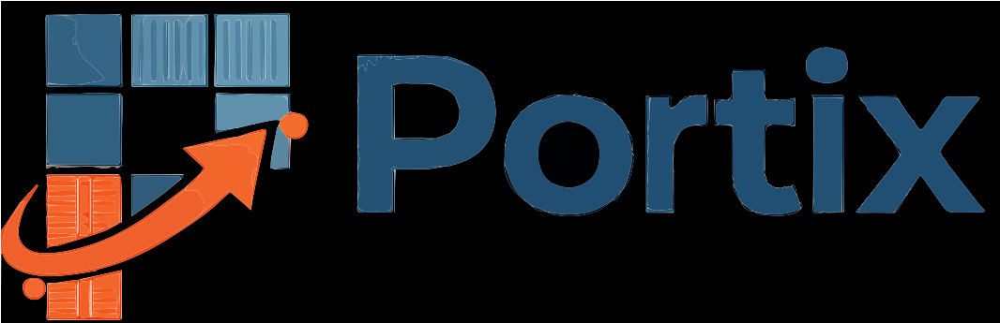
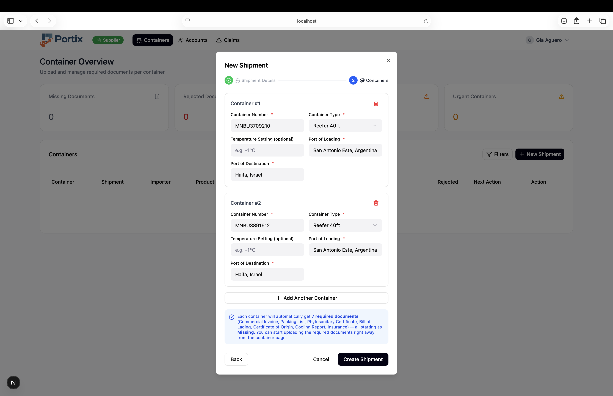
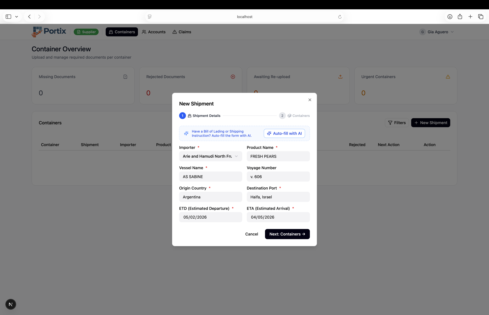
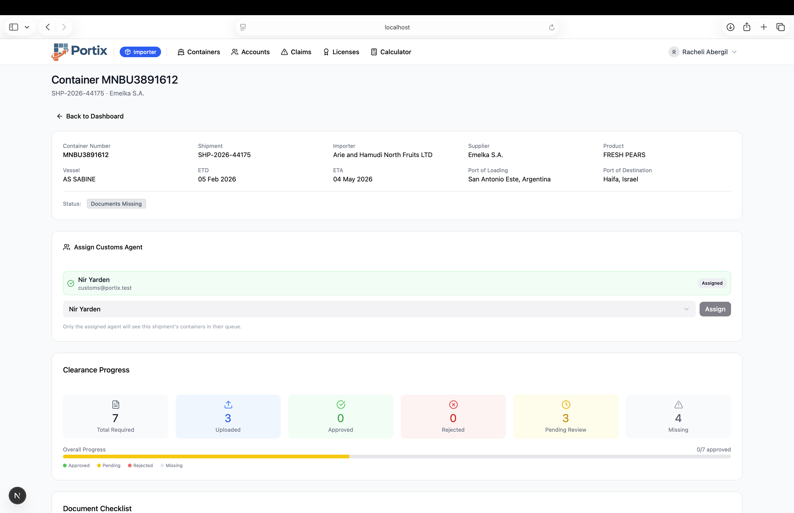
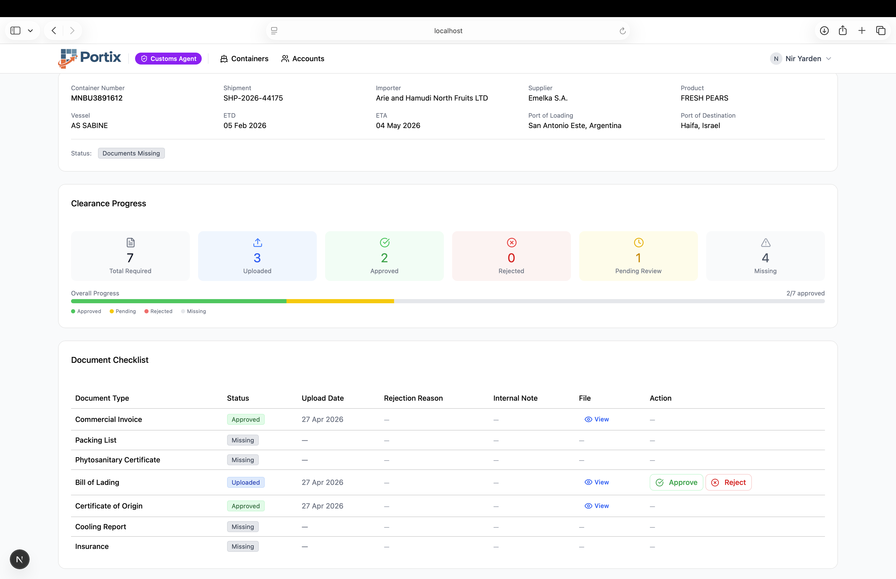
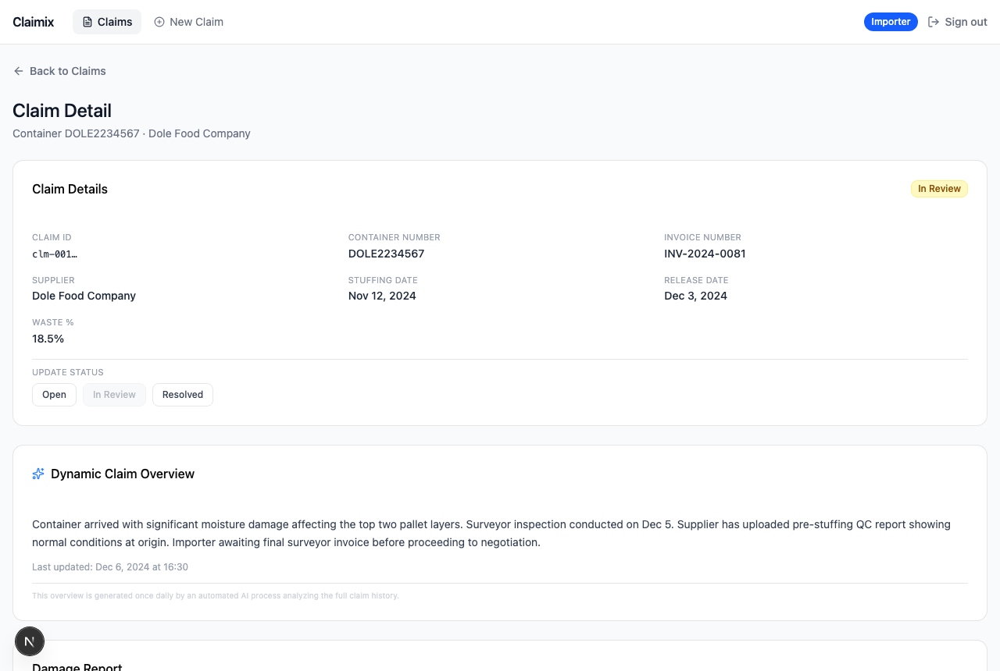
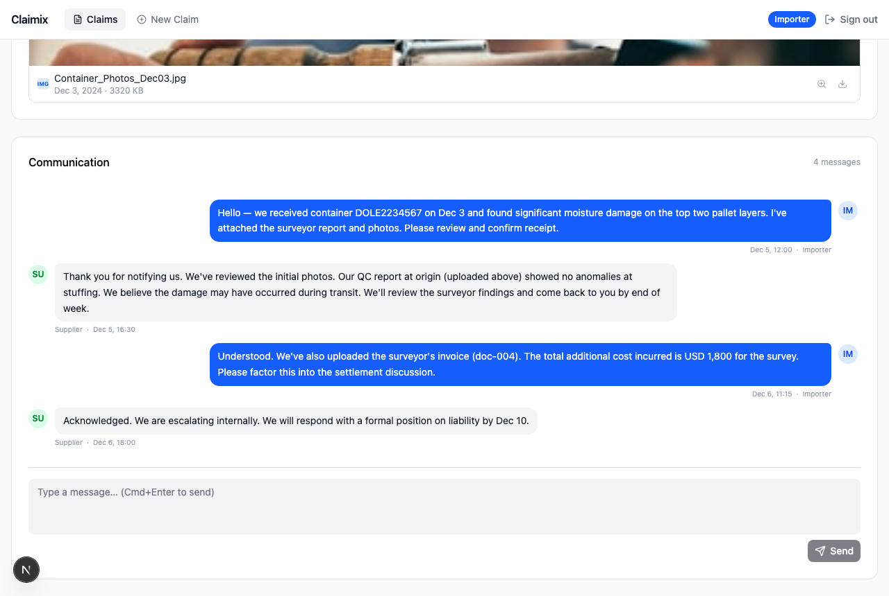
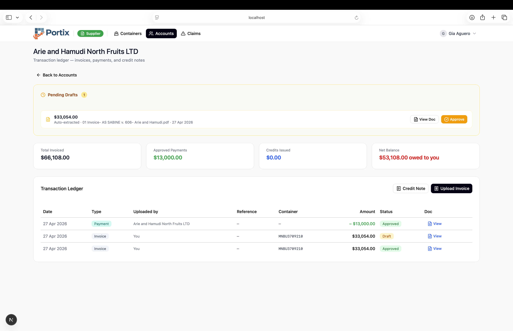
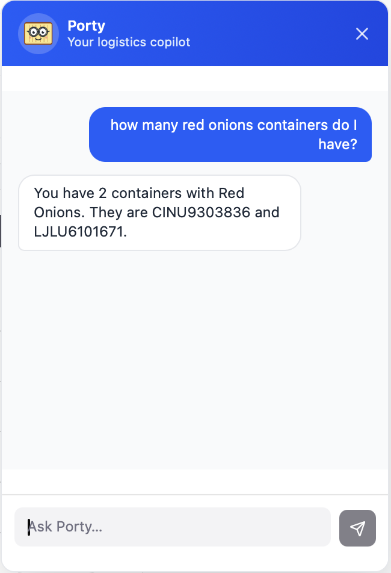

<div align="center">



# The Zero-Touch Intelligent Logistics OS

**Portix eliminates manual work across the entire import/export lifecycle — from supplier document upload to customs clearance — using multimodal AI, real-time collaboration, and enterprise-grade security.**

*Built for the teams moving the world's produce, one container at a time.*

---

[](https://nextjs.org/)
[](https://www.typescriptlang.org/)
[](https://supabase.com/)
[](https://ai.google.dev/)
[](https://tailwindcss.com/)
[](https://tanstack.com/query)

</div>

---

## The Problem with Global Trade Today

Every shipment of fresh produce, electronics, or industrial goods crosses borders through a gauntlet of paperwork, manual coordination, and fragmented communication. A single 40ft reefer container generates **7 mandatory customs documents**, requires coordination between **3 to 5 parties**, and can be delayed by weeks if even one document is rejected.

The industry still runs on WhatsApp threads, emailed PDFs, and spreadsheets. Customs clearance delays cost the average importer **$300–$800 per day** in storage fees alone.

**Portix closes that gap.** It's the operating system for cross-border trade — connecting importers, suppliers, and customs agents in a single workspace where AI handles the paperwork and humans handle the decisions.

---

## How It Works: The Three-Party Workflow

```
Supplier                    Portix AI Engine               Importer / Customs Agent
────────                    ─────────────────               ───────────────────────
Upload any document   →     Classify · Extract · Route  →  Instant visibility + review
(invoice, BL, cert…)        (Gemini 2.5 Flash)             (zero re-entry, zero email)
```

Portix is built around **the container as the unit of work**. Every document, every status, every transaction, every dispute lives on the container — not in a disconnected ERP or email thread.

---

## Core Product Modules

---

### 01 · AI-Powered Document Ingestion

> *"Upload once. Portix figures out the rest."*



A supplier uploads a single PDF — it could be a commercial invoice, a "Frankenstein" bundle with three document types merged, or an image taken on a phone at the port. Portix sends it to **Google Gemini 2.5 Flash** with a multimodal classification prompt.

Gemini identifies every document type present, extracts structured metadata (supplier name, invoice total, container number, issue date), and maps the result to the correct container row — **without the supplier specifying anything**.

**What gets extracted automatically:**
- Document type (`commercial_invoice`, `bill_of_lading`, `certificate_of_origin`, and 4 more)
- Container number — matched to the correct container in a multi-container shipment
- `extractedData`: supplier name · total amount · currency · item count
- `document_number` and `issue_date` for audit trails

**When a document covers `ALL` containers** (e.g. a BL for an entire shipment), Portix fans the update out across every sibling container automatically.

**Business Impact**

| Metric | Before Portix | With Portix |
|---|---|---|
| Time to classify & file a document | 8–15 min (manual) | < 5 seconds |
| Re-keying errors | Common — 1 in 12 documents | Zero |
| Multi-container document routing | Manual email to coordinator | Automatic fan-out |
| Supplier onboarding friction | Training required | Upload → done |

---

### 02 · Shipment Creation with AI Auto-Fill

> *"Bill of Lading or shipping instruction → full shipment form in one click."*

<table>
<tr>
<td width="50%">



</td>
<td width="50%">


</td>
</tr>
</table>

Creating a new shipment is a two-step wizard. In step 1 the supplier fills in shipment details — or uploads a Bill of Lading or shipping instruction and hits **Auto-fill with AI**. Gemini reads the document, extracts vessel name, voyage number, origin country, ports, ETD/ETA, importer, and product — and populates every field automatically.

Step 2 lets the supplier add one or more containers to the shipment (Reefer 40ft, temperature setting, per-container port details). Portix immediately creates **7 required document slots** for every container — Commercial Invoice, Packing List, Phytosanitary Certificate, Bill of Lading, Certificate of Origin, Cooling Report, and Insurance Certificate — all pre-set to `missing`, ready for upload.

**Business Impact**

| Step | Manual | With AI Auto-Fill |
|---|---|---|
| Shipment form entry | 10–15 min (copy-paste from PDF) | ~5 seconds |
| Missing fields / typos | Common | Eliminated — extracted from source document |
| Container document slots | Created manually or forgotten | Auto-created for all 7 types per container |

---

### 03 · The Importer Control Tower

> *"Real-time visibility across every container, every voyage, every partner."*



The importer dashboard gives live visibility into each container's clearance progress. The **Assign Customs Agent** panel lets the importer pick from the platform directory — from that moment, only that agent sees these containers in their review queue.

The **Clearance Progress** tracker shows 7 document slots in real time: how many are uploaded, approved, rejected, pending review, or still missing. A per-container progress bar gives an instant visual read of how close a container is to clearance.

The importer navigation also exposes **Licenses** (import license management per importer-supplier pair) and **Calculator** — tools built specifically for the importer role beyond container tracking.

**Key capabilities:**
- **Clearance Progress bar** — visual 7-of-7 document approval tracker per container
- **One-click customs agent assignment** — scoped visibility; agent sees nothing until assigned
- **Import License management** — license status, expiry tracking, auto-computed via `GENERATED ALWAYS AS`
- **KPI dashboard** — Active Containers · Waiting Review · Rejected · Ready for Clearance

**Business Impact**

| Metric | Before Portix | With Portix |
|---|---|---|
| Time to check shipment status | 15 min (emails + calls) | Instant |
| Risk of assigning wrong agent | High (verbal/email) | Eliminated — enforced by DB RLS |
| ETA surprise delays | Common | Proactive carrier API alerts |
| Customs agent accountability | None | Full audit trail per document |

---

### 04 · The Compliance Engine

> *"Every document. Every container. Every approval — tracked, enforced, and auditable."*



The customs agent gets their own scoped workspace: a queue of exactly the shipments they have been assigned to — nothing more, nothing less. The 7-document checklist is the heart of the clearance workflow. Each document row shows its upload date, current status, rejection reason, and an **Internal Note** column visible only to the agent.

**The enforcement rules are DB-level, not UI-level:**
- A container cannot advance to `ready_for_clearance` until all 7 documents are in `approved` status — enforced by a PostgreSQL trigger, not frontend logic
- Rejecting a document requires a mandatory free-text reason — enforced by a `CHECK` constraint
- An approved document can never be overwritten — status transitions are one-way in the DB
- The agent's `internal_note` column is **column-level secured** via `v_documents_public` view — importers and suppliers never see it, even via direct REST API calls

**Document lifecycle:**
```
missing → uploaded → under_review → approved ✓
                                  ↘ rejected → (supplier re-uploads) → uploaded → ...
```

**Business Impact**

| Risk | Industry Standard | Portix |
|---|---|---|
| Document forgery / substitution | Manual visual check | Immutable upload audit trail |
| Rejection without explanation | Verbal / email | Mandatory reason, stored permanently |
| Internal agent notes leaking | Separate system | Column-level RLS — cryptographically isolated |
| Clearance advance without full docs | Possible | Impossible — DB trigger blocks it |

---

### 05 · Integrated Claims & Dispute Resolution

> *"When goods arrive damaged, every hour without resolution costs money. Portix resolves disputes in days, not months."*

<table>
<tr>
<td width="50%">



</td>
<td width="50%">



</td>
</tr>
</table>

Import claims — damaged goods, short shipments, quality disputes — are one of the most expensive and time-consuming parts of cross-border trade. Traditionally they play out over email chains that span weeks, with evidence scattered across inboxes and no shared record of what was agreed.

Portix embeds a **structured dispute resolution workspace** directly inside the container that the claim relates to. The importer opens a claim with a claim type, estimated amount, and description. From that moment, the importer and supplier share a persistent, evidence-linked thread.

**What makes this different from email:**

- **Context-aware** — the claim is linked to the exact container, shipment, invoice, and document records. Every message can reference evidence already in the system.
- **AI-generated dynamic summary** — Gemini reads the full claim history (messages, documents, amounts) and writes a concise, neutral situation summary. It updates automatically every night at 23:00 UTC via `pg_cron`, and can be refreshed on-demand with one click.
- **File attachments with lightbox preview** — surveyors' reports, cargo photos, invoices dragged directly into the thread
- **Real-time delivery** — messages appear instantly via Supabase Realtime `postgres_changes` subscriptions. No polling, no refresh.
- **Structured damage report** — waste %, affected units, estimated loss, inspector details — stored as structured data, not buried in a PDF

**Claim status flow:**
```
open → under_review → negotiation → resolved → closed
```

**Business Impact**

| Metric | Industry Standard | Portix |
|---|---|---|
| Average time to first supplier response | 3–7 days (email) | Same session (realtime chat) |
| Evidence organisation | Scattered across inboxes | Centralised, linked to container |
| Dispute summary for management | Manual write-up | AI-generated, always current |
| Audit trail for legal escalation | Fragmented | Complete, timestamped, tamper-evident |
| Cost of unresolved claims per shipment | $2,000–$15,000+ | Proactive resolution pathway |

---

### 06 · Intelligent Financial Ledger

> *"From invoice PDF to draft transaction in seconds. No data entry. No reconciliation gaps."*



The accounts module maintains a live per-partner ledger of every invoice, payment, and credit note — with **automatic draft creation powered by invoice OCR**.

When a supplier uploads a commercial invoice, the `classify-documents` Edge Function extracts the `totalAmount` via Gemini and automatically calls `handle_make_invoice_draft` — creating a pending transaction record linked to the correct container. The supplier sees it in "Pending Drafts" and approves it in one click. No manual entry. No reconciliation meeting.

**What the ledger tracks:**
- `Total Invoiced` — sum of all approved invoice transactions
- `Approved Payments` — SWIFT payments confirmed with proof-of-payment upload
- `Credits Issued` — credit notes raised against rejected or damaged goods
- `Net Balance` — three-state display: debt (red) · credit (green) · settled (grey)

**SWIFT proof-of-payment flow:**
The importer uploads a SWIFT document to the `swift-documents` private storage bucket. Portix stores a signed URL reference linked to the payment record — giving both parties a verifiable payment proof without exposing raw banking data.

**Business Impact**

| Process | Before Portix | With Portix |
|---|---|---|
| Invoice entry after document upload | Manual, same-day or next-day | Automatic — seconds after upload |
| Reconciliation meeting cadence | Weekly or monthly | Eliminated — ledger is always current |
| Payment proof storage | Emailed PDFs | Signed URL in private bucket, permanently linked |
| Outstanding balance visibility | Finance team only | Both parties, real-time |

---

### 07 · Porty — Agentic AI Copilot

> *"Ask anything about your fleet. Get facts, not hallucinations."*



Porty is the floating AI assistant embedded in every dashboard. Ask in plain language — "How many red onion containers do I have?" — and Porty queries live data, not a cached snapshot.

Under the hood, Porty runs a **two-phase Agentic RAG architecture** built on Gemini 2.5 Flash and `gemini-embedding-2` (768-dim):

```
User question
  │
  ▼
[Phase 1: generateContent — up to 3 rounds]
  System prompt + conversation history + two tool declarations
  │
  ├─ get_live_containers_summary  →  queries portix.v_containers (live, RLS-scoped)
  └─ search_container_documents   →  hybrid similarity + two-pass relational chunk pull
  │
  ▼ (no more tool calls)
[Phase 2: streamGenerateContent]
  Re-send full context (history + tool results)
  Stream final answer back to client
```

**Two tools, clear routing:**

| Tool | When Porty calls it | What it returns |
|---|---|---|
| `get_live_containers_summary` | Fleet-level questions: counts, statuses, ETAs, vessels, ports | All containers the caller can see — live, RLS-scoped |
| `search_container_documents` | Document-level facts: weights, HS codes, carton counts, invoice amounts, seal numbers | Hybrid similarity + targeted relational chunk pull |

**Smart retrieval — two-pass relational pull:**  
When a specific container is named, Porty doesn't blindly grab 60 chunks in insertion order (which returns Terms & Conditions boilerplate). It runs two passes:
1. **Pass 1** — keyword-filtered: `content ILIKE %weight%` etc. from `extractRelKeywords(query)` — captures targeted measurement/fact chunks.
2. **Pass 2** — unfiltered fallback to fill remaining slots up to cap.

**Contextual Deduction — zero hardcoding:**  
Porty never relies on hardcoded word mappings (e.g. "בצל סגול = red onion"). Instead it calls `get_live_containers_summary` first, reads actual product values from the live DB, and uses its own trade knowledge to resolve informal terms to canonical DB values. Works for any commodity, any language.

**Security boundaries:**
- `supabaseAnon` (user JWT) for all container ownership checks — RLS enforced automatically
- `supabaseAdmin` (service role) only inside document chunk fetch, *after* container IDs are already privacy-filtered
- Container UUIDs never leave the server — only ISO 6346 numbers are returned to the model
- `scrubIdentifiers()` strips UUIDs and hex tokens from chunk content before Gemini reads it

**Business Impact**

| Query type | Before Portix | With Porty |
|---|---|---|
| "How many containers waiting review?" | Open dashboard, count rows | Instant natural language answer |
| "What's the tare weight of SEGU9467227?" | Open container → find BL PDF → read it | Porty reads the document and answers |
| "Which containers have frozen cargo?" | Manual filter + open each BL | Fleet-wide semantic search across all documents |
| Cross-language queries (Hebrew/English) | N/A | Contextual deduction via live DB — no maintenance |

---

## Technical Architecture — The Secret Sauce

### Resilient AI Infrastructure: 3-Tier Gemini Failover

Production AI workloads fail. Gemini 2.5 Flash is under constant demand from global users — 503 overload and 429 rate-limit responses are a real operational risk. Portix treats AI calls like distributed systems: with automatic fallback and zero user-visible failure.

```
Request
  │
  ▼
┌─────────────────────────────────────────────────┐
│  Tier 1: gemini-2.5-flash                        │  ← Primary: fastest, most capable
│  503 Overloaded / 429 Rate Limited / 404 Gone → │
│  Tier 2: gemini-3-flash                          │  ← Fallback 1: alternate model
│  503 / 429 / 404 →                               │
│  Tier 3: gemini-2.5-pro                          │  ← Fallback 2: most robust
│  All fail →                                      │
│  Return 503 with user-friendly message           │
└─────────────────────────────────────────────────┘
```

**Why 404 is also a fallback condition:** Model IDs change as Google releases and deprecates versions. Portix treats a 404 "model not found" response as a graceful signal to try the next tier — it future-proofs the system against Google's model version lifecycle without a code change.

Every other HTTP error (400 invalid prompt, 401 invalid key) triggers an immediate fail-fast response — only overload/rate-limit/not-found conditions trigger the fallback loop.

**Implemented as Supabase Deno Edge Functions** — cold-start time under 80ms, global edge deployment, no server management.

---

### Enterprise Security: Company-Level Secure Multi-Tenancy

Portix runs all three user roles — importers, suppliers, and customs agents — in a **single shared PostgreSQL database** with zero data leakage between companies. Security is enforced at the database level via PostgreSQL Row Level Security (RLS), not the application layer.

**Why database-level matters:** Application-level filtering can be bypassed. A bug in a React component, a misconfigured API route, or a direct Supabase REST API call can all expose data if security lives in the app. With Portix's RLS policies, even if a user made a direct API call with a known container UUID, they would receive zero rows — the database itself enforces the boundary.

**Access is COMPANY-LEVEL, not user-level.** Multiple employees at the same company (same importer org or supplier org) all share access to their company's containers, documents, and claims — without needing the exact user ID that created the record.

```
┌─────────────────────────────────────────────────────────────────┐
│  auth.uid()  ←  Supabase JWT (verified, tamper-proof)           │
│                                                                 │
│  POLICY: containers                                             │
│  ├─ Importer  →  importer_id = ANY(get_company_importer_ids())  │  ← all users in same company
│  ├─ Supplier  →  supplier_id = ANY(get_company_supplier_ids())  │  ← all users in same supplier org
│  └─ Agent     →  portix.is_customs_agent()                      │  ← role-based, flat
│                                                                 │
│  COLUMN-LEVEL: documents.internal_note                          │
│  └─ Only customs_agent can SELECT — enforced via view           │
└─────────────────────────────────────────────────────────────────┘
```

**Six SECURITY DEFINER helper functions** (all `STABLE`, bypass profiles RLS safely):

| Function | Purpose |
|---|---|
| `get_user_company_name()` | Caller's `company_name` from profiles |
| `get_user_supplier_org_id()` | Caller's `supplier_org_id` from profiles |
| `get_company_importer_ids()` | All profile UUIDs sharing the caller's importer company |
| `get_company_supplier_ids()` | All profile UUIDs sharing the caller's supplier org |
| `is_customs_agent_for_shipment(uuid)` | Is `auth.uid()` the assigned agent? Reads shipments without triggering shipments RLS |
| `does_company_own_shipment(uuid)` | Does caller's company own any container in the shipment? Reads containers without triggering containers RLS |

**Key security properties:**

| Property | Implementation |
|---|---|
| Cross-company data isolation | Company-level RLS per row, per table, per operation |
| Agent scoping | Agent only sees containers in assigned shipments |
| Internal note isolation | Column-level security via `v_documents_public` view |
| Storage access | All buckets private — downloads via signed URLs, 1-hour expiry |
| Service-role operations | AI Edge Functions use service role key — RLS bypassed only server-side, after ownership verified |
| Anti-recursion | Cross-table RLS lookups always use SECURITY DEFINER helpers — never raw `SELECT FROM containers` inside a `shipments` policy or vice versa (avoids `ERROR 42P17`) |

---

## Tech Stack

<div align="center">

| Layer | Technology | Why |
|---|---|---|
| **Framework** | Next.js 15 App Router | Server components, file-based routing, edge-ready |
| **Language** | TypeScript (strict mode) | Type safety across DB ↔ API ↔ UI boundary |
| **Styling** | Tailwind CSS v4 | Zero-config, token-based design system |
| **Components** | shadcn/ui + Radix UI | Accessible primitives, fully owned source code |
| **Database** | Supabase PostgreSQL | RLS, Realtime, Storage — one platform |
| **Auth** | Supabase Auth | JWT-based, row-level security integration |
| **Storage** | Supabase Storage (4 buckets) | Private, signed-URL access |
| **AI** | Google Gemini 2.5 Flash + gemini-embedding-2 | Multimodal PDF understanding + 768-dim RAG embeddings |
| **AI Runtime** | Supabase Edge Functions (Deno) | Isolated, global, cold-start < 80ms |
| **State** | TanStack Query v5 | Stale-while-revalidate, optimistic updates |
| **Realtime** | Supabase Realtime | `postgres_changes` subscriptions |
| **Cron** | pg_cron + Supabase Vault | Nightly AI summaries, secret rotation |

</div>

---

<div align="center">

Built with [Next.js](https://nextjs.org/) · [Supabase](https://supabase.com/) · [Google Gemini](https://ai.google.dev/)

*Portix — Moving goods, not paperwork.*

</div>
